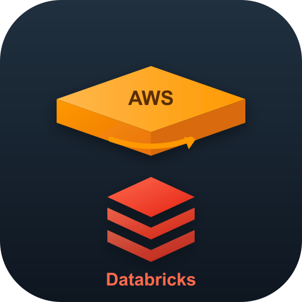

# Databricks Sharing Architecture Advisor

A Kiro Power that recommends the best Databricks data-sharing architecture for a
given scenario — Delta Sharing, Direct Grant, Iceberg REST, JDBC/ODBC SQL warehouse,
or a shared external location — by asking discovery questions and applying a
deterministic decision tree.

## What it produces

For a described scenario (metastore/account/region topology, consumer platform,
identity, data characteristics, freshness, security, and compliance needs) it returns:

- A primary and secondary solution from the solution catalog
- Prerequisites, security measures, warnings, and cost considerations
- Step-by-step implementation with ready-to-run SQL/code
- An architecture diagram
- An optional publish to Confluence via the Atlassian MCP

## Getting started

Activate the power and describe your setup in natural language, or fill in the sample
prompt template from `POWER.md`. See `POWER.md` for the full decision tree, discovery
questions, solution catalog, and generated SQL templates.

## Files

- `POWER.md` — the power definition, decision logic, and templates
- `mcp.json` — Atlassian Confluence MCP configuration
- `steering/` — per-solution reference guides
- `icon.svg` / `icon.png` — power artwork (AWS platform on top of Databricks)
